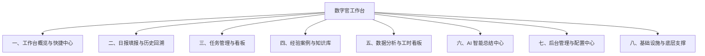

# 数字官工作台 — 系统模块与功能全景梳理

> **状态**：[权威/现行]  
> **更新时间**：2026-08-30  
> **文档定位**：全量业务模块、功能清单与系统技术架构的全景参考文档。

---

## 一、系统总体定位与架构愿景

**数字官工作台 (Digital Officer Log)** 是专为工厂车间数字化运营、现场巡检、日报填报、任务流转管理、故障案例沉淀及 AI 智能运营总结打造的一体化综合工作台。系统旨在帮助现场数字官规范日常工作流程、自动化汇总运营数据、沉淀一线排错经验，并为管理决策提供可视化数据支撑。

### 核心技术栈

- **前端框架**：Next.js 16 (App Router) + React 19 + TypeScript (Strict 模式)
- **UI 与交互**：TailwindCSS v4 + Radix UI + Lucide Icons + Recharts + Sonner (Toast) + react-day-picker
- **数据持久层**：Prisma ORM 5.22 + PostgreSQL (支持 Supabase / 云数据库 / 本地 Postgres 直连与连接池)
- **文件与对象存储**：AWS S3 SDK (`@aws-sdk/client-s3`)，无缝集成 MinIO / 兼容 S3 对象存储服务
- **AI 智能引擎**：OpenAI API（自动化周报总结、工单语义提取与排错建议）
- **底层与辅助库**：`xlsx` (Excel 导入导出)、`tesseract.js` (OCR 文字识别)、`node-cron` (后台定时自动汇总)
- **测试体系**：Jest 29 + React Testing Library + `@testing-library/jest-dom`

---

## 二、业务功能模块全景矩阵

系统当前划分为 **7 大业务模块 + 1 大底层支撑模块**：

---

## 三、各模块功能清单与详细说明

### 1. 工作台概览与快捷中心 (Dashboard)
- **路由路径**：`/`
- **核心组件**：`src/app/page.tsx`, `src/app/dashboard-client.tsx`, `src/components/UpdateAnnouncement.tsx`
- **主要功能**：
  1. **统计概览指标卡**：实时展示今日日报提交状态、待办/进行中/已完成任务数量、累计工时投入等关键度量。
  2. **快捷入口导航**：展示常用操作卡片（快捷填报日报、快速创建任务、录入故障案例、跳转数据分析）。
  3. **外部系统快速链接 (Quick Links)**：展示由管理员后台配置的常用业务系统链接，支持一键点击直达。
  4. **版本更新与公告弹窗**：自动识别最新系统更新公告，支持版本标记、更新详情展示、强制阅读与“不再提示”记忆。

---

### 2. 日报填报与历史回溯 (Daily Report)
- **路由路径**：`/report/new`, `/report/[date]`
- **核心逻辑**：`src/app/actions/submit-report.ts`, `src/components/ExcelExportBtn.tsx`
- **主要功能**：
  1. **动态模板表单填报**：根据后台配置的问卷题目（单行文本、多行文本、单选题、多选题、下拉列表、动态增行表格 `dynamic_list`）自适应动态渲染表单。
  2. **责任区域与工号关联**：自动绑定当前登录数字官的工号与负责车间/区域，支持区域校验。
  3. **日报历史回溯查阅**：支持按日期筛选查询历史日报，展示各问题的详细填报答案与多行表格记录。
  4. **Excel 导出与归档**：支持将指定日期的全量日报结构化导出为 Excel 文件（`.xlsx`）。

---

### 3. 任务管理与可视化看板 (Task Management)
- **路由路径**：`/tasks`, `/tasks/history`, `/tasks/logs`
- **核心组件**：`src/app/tasks/task-board.tsx`, `src/components/TaskCard.tsx`, `src/components/DraggableDuration.tsx`, `src/app/actions/task.ts`
- **主要功能**：
  1. **看板与列表多重视图**：支持待处理、进行中、已完成状态流转，支持卡片拖拽与排序。
  2. **工时与时长精细化管理**：支持可视化拖拽调整任务预估/实际耗时（`DraggableDuration`），记录任务开始时间与截止时间（Deadline）。
  3. **地点与优先级维度**：任务支持指定车间地点、优先级标签与任务描述。
  4. **全生命周期审计日志 (TaskLog)**：系统自动记录任务的每一次操作（创建、修改时长、变更状态、删除等），包含操作人、时间戳与变动明细。
  5. **历史任务检索与归档**：支持历史任务的多维度筛选与查看。

---

### 4. 经验案例与知识库 (Knowledge Base / Issues)
- **路由路径**：`/knowledge`, `/knowledge/create`
- **核心逻辑**：`src/app/actions/issue.ts`, `src/lib/minio.ts`
- **主要功能**：
  1. **故障与问题建档**：记录车间异常问题标题、现象描述，支持上传现场故障图片（多图直传 MinIO/S3）。
  2. **解决方案与改善措施归档**：记录排查过程、根本原因分析、采取的解决措施以及改善后的现场佐证图片。
  3. **案例检索与经验共享**：支持按关键词、创建人快速检索知识库，沉淀可复用的排错指南。

---

### 5. 数据分析与工时看板 (Data Analysis)
- **路由路径**：`/analysis`
- **核心逻辑**：`src/app/actions/analysis.ts`
- **主要功能**：
  1. **时间维度自由筛选**：支持按自定义日期区间（最近 7 天、本月、本季度或任意起止时间）聚合统计。
  2. **多维度工时透视分析**：
     - 各车间/区域工时分布占比；
     - 个人与团队任务完成率与交付负荷；
     - 日报巡检频次趋势统计。
  3. **可视化图表渲染**：基于 Recharts 构建响应式柱状图、趋势折线图、环形占比图。

---

### 6. AI 智能周报/月报与总结中心 (AI Summaries)
- **路由路径**：`/ai-summaries`
- **核心逻辑**：`src/app/actions/ai.ts`, `src/lib/cron.ts`, `src/instrumentation.ts`
- **主要功能**：
  1. **一键生成 AI 智能总结**：用户指定时间周期（如上周、本周、指定月份），系统自动抓取该时间段内的日报内容与任务执行情况，结合大模型 prompt 自动提取：
     - 本周期核心成果与进展；
     - 现场主要痛点、卡点与高频异常；
     - 下阶段工作推进建议。
  2. **历史总结台账**：存储历史生成的 AI 报告，支持查看完整 Markdown 报告、复制或分享。
  3. **后台定时自动生成 (Cron)**：结合 Node-cron 与 Next.js Instrumentation 钩子，可在每周/月固定时间自动触发总结任务。

---

### 7. 后台管理与配置中心 (Admin Settings)
- **路由路径**：`/admin/users`, `/admin/template`, `/admin/system`
- **核心逻辑**：`src/app/actions/admin.ts`
- **主要功能**：
  1. **用户与角色权限管理 (`/admin/users`)**：
     - 用户增删改查、工号唯一校验、姓名、分配负责区域配置；
     - 初始默认密码设定与重置；
     - 角色（Role）绑定与权限隔离。
  2. **动态表单模板配置器 (`/admin/template`)**：
     - 自定义日报问卷题目与类别；
     - 字段类型配置（Text、Textarea、Radio、Checkbox、Select、Dynamic List）；
     - 题目上下移动排序、启用/禁用状态切换。
  3. **系统设置与公告管理 (`/admin/system`)**：
     - 系统全局配置键值对维护（`SystemConfig`）；
     - 首页版本更新公告编辑与发布；
     - 首页快捷链接（QuickLink）的新增、排序与管理。

---

### 8. 基础设施与底层支撑 (Infrastructure & Core Libs)
- **模块目录**：`src/lib/`, `src/app/actions/auth.ts`, `src/app/api/`
- **主要支撑**：
  1. **统一认证与鉴权**：基于 Cookie / Session 机制的轻量身份鉴权，支持工号免复杂注册及首次登录强制改密提醒。
  2. **对象存储服务 (`src/lib/minio.ts`)**：封装 S3/MinIO 客户端，提供图片与文件安全上传、下载及公共 URL 生成。
  3. **数据库统一实例 (`src/lib/prisma.ts`)**：单例模式 PrismaClient，适配 Serverless/Node.js 环境防连接池耗尽。
  4. **类型安全与规范校验**：基于 Zod 与 TypeScript 严格类型定义的 Server Actions 统一返回结构。

---

## 四、数据模型与实体关系映射 (Data Schema Overview)

系统核心实体定义位于 `prisma/schema.prisma`，核心模型如下表所示：

| 数据模型 (Model) | 对应数据表 | 核心用途与关联关系 |
| --- | --- | --- |
| **`User`** | 用户表 | 存储工号 (`workId`)、密码、姓名、负责区域 (`assignedAreas`)；一对多关联 `DailyReport`、`Task`、`Issue`、`AISummary`，多对多关联 `Role`。 |
| **`Role`** | 角色表 | 角色定义（如管理员、普通数字官），与 `User` 形成多对多关联。 |
| **`Question`** | 日报题目模板表 | 存储动态问卷的题目标题、类别、字段类型 (`type`)、JSON 格式选项配置 (`options`)、排序权重与启用开关。 |
| **`DailyReport`** | 日报记录表 | 存储数字官提交的日期、负责区域、摘要与 JSON 格式答案数据 (`answers`)，索引 `date` 与 `userId`。 |
| **`Task`** | 任务表 | 存储任务内容、地点、截止时间、完成状态、排序权重、开始时间与持续时长 (`duration`)；一对多关联 `TaskLog`。 |
| **`TaskLog`** | 任务操作日志表 | 存储任务每次变动的操作人 (`operatorId`/`operatorName`)、动作类型 (`action`)、变更详情与时间戳。 |
| **`Issue`** | 故障案例表 | 存储问题标题、现象描述与故障图片、解决方案描述与改善后图片，关联创建用户。 |
| **`AISummary`** | AI 总结记录表 | 存储 AI 生成的周报/月报 Markdown 内容、统计起止时间 (`startDate`/`endDate`)，关联用户。 |
| **`QuickLink`** | 快捷链接表 | 存储首页快捷导航的标题、URL 地址与排序权重。 |
| **`SystemConfig`** | 系统参数配置表 | 以 Key-Value 形式存储系统公告、全局功能开关等系统级配置项。 |

---

## 五、未来规划功能与演进路线（参考暂存需求）

根据项目规划与业务探索（参考 [`docs/rcfs/暂时的规划.md`](file:///d:/j/OpenProject/Nextproject/digital-officer-log/docs/rcfs/暂时的规划.md)），后续重点演进方向包括：
1. **周维度系统使用情况自动化总结（海铭德系统）**：
   - 生产头条、QC头条、新随拍打卡、设备点检/保养、综合点检等 Excel 数据导入与多表数据清洗；
   - 自动计算开卡数、停机/处理时长超标统计、各部门开卡占比与周环比增长率；
   - 一键生成周总结图表与企微/DMS群推送内容。
2. **工牌生成器集成**：基于当前技术栈重构工牌生成模块，支持工号唯一防重。
3. **班次提醒与转班小助手集成**：研发与生产人员班次变动自动通知。
4. **车间 UPH（Units Per Hour）产出效率分析**：深入车间产线生产节拍与产出分析。
